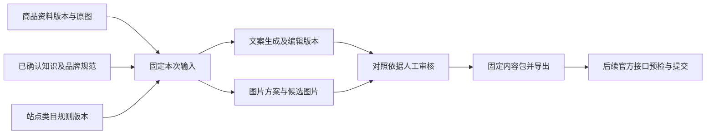

# 图文工作台：实施设计

日期：2026-09-29。状态：设计基线；功能完成状态以 `docs/tasks/IMPLEMENTATION_STATUS.md` 和实际测试为准。

## 目标与现有基础

从真实商品资料与原图出发，完成关键词选择、文案制作、图片制作、人工审核和交付，保存制作依据。首个验收目标是本地单工作空间、US 英文普通单品。采用既有 TypeScript、Zod、Hono、React/Ant Design、LangGraph、SQLite 与文件存储。

源码基线 `ce20ea3`：商品与不可变资料版本、原图存储已实现；四项 CLI/工作台能力已有实现。工作台生成仍接收裸 brief，未关联商品；LLM 仅为显式调用的可选润色分支；没有业务内容版本、人工审核、知识库或图片生成。这些是下一阶段工作，不应称作既有能力。

## 业务关系

知识库是产品运行时的数据；`.agents/skills` 是开发智能体的工程规范，两者独立。Codex 自带的模型与图片工具不等于软件运行时已经获得相应 API 权限。

## 知识库

| 类型 | 作用域与约束 | 内容 |
| --- | --- | --- |
| 商品事实 | 必须关联商品；检索严格限定该商品 | 材料、规格、使用范围、包装清单、资料来源 |
| 品牌规范 | 显式选择适用品牌/商品集合 | 字体、配色、Logo 使用、语气、禁用表达 |
| 平台规则 | 站点、类目、用途、有效日期 | 官方规则摘要及来源，结构化可执行限制 |
| 设计参考 | 显式标为参考，不能证明产品功能 | 已批准构图、版式、提示词与修改原因 |

第一片提供有来源说明的文本知识、版本、人工确认、筛选和全文检索。纯文本/Markdown 导入是最小文档入口。PDF、扫描件 OCR、图像相似检索在独立切片实现和验证，不能把文件上传成功当作解析成功。初期无独立向量数据库；后续语义检索只帮助找到相关资料，商品事实仍按明确 ID 和已确认版本读取。

每项知识有稳定 ID、版本、来源、适用范围和审核状态。编辑生成新版本；只有明确确认过的版本能作为事实依据。生成记录保存本次实际使用的文本与版本 ID。资料冲突必须显示，不能合并猜测；模型生成内容不能自动晋升为已确认知识。

## 文案与规则

商品详情提供制作入口，显示 SKU、资料版本、站点和知识依据。关键词可研究获取，也可手动输入；用户选择主词、排序、排除不适用候选。公开补全是词语建议，不能成为商品功能证据。

新增文案结构包含标题、Item Highlights、五点、描述、后台词，保存选择的关键词和规则版本。保留旧 `ListingCopy` / CLI 的历史契约；新业务接口采用附加契约。前端计数、服务端校验、模板、模型输出校验和导出引用相同规则。

US 普通非媒体单品设计依据：Amazon 官方公告自 2026-07-27 起标题 75 字符、Item Highlights 125 字符。细分类目与其他站点在启用前核对适用规则；不把单一规则宣称为全站完整合规判断。历史 200 字符文案不自动改写；显示其原规则及重新检查结果。

来源：[Amazon 标题公告](https://sellercentral.amazon.com/seller-forums/discussions/t/2f40628c-eb97-4b24-b983-cb1e331e06dc)。规则条目保存来源 URL、核查日期、适用范围和版本。

生成模式由用户明确选择模板或模型。模型未配置、超时、结构无效、事实需核对均有真实状态；不把静默模板回退标成模型成功。文本与图片服务由独立 provider 接口承载，模型、端点与密钥只从后端配置读取。

## 内容、任务与审核

| 对象 | 最小信息 | 不变量 |
| --- | --- | --- |
| 文案版本 | 商品/资料版本、站点/语言、正文、关键词、知识引用、规则、来源、父版本、创建时间 | 已保存版本不可改写；保存新稿检查基准版本 |
| 生成记录 | 请求 ID、类型、固定输入、幂等键、状态、提供方、模型、产物、错误、用量 | 重试不能覆盖成功产物；同键不同输入拒绝 |
| 图片方案 | 资料与原图、用途、卖点、布局、文字 | 引用同商品原图；待确认事实不可自动补齐 |
| 派生图片 | 原图版本、方案、任务、文件哈希、尺寸、创建时间 | 不覆盖原图或旧候选；服务端生成存储路径 |
| 人工审核 | 具体内容版本、批准/退回、意见、时间 | 审核不等于算法评分；修改产生新待审版本 |
| 内容包 | 固定文案、图片顺序、审核与依据清单 | 旧包不随最新稿变化；草稿导出明确标记 |
| 批次 | 固定商品任务列表、逐项状态、失败记录 | 单项失败不回滚其他成功项 |

任务状态至少区分排队、运行、成功、失败和中断/结果待确认。正常关闭等待已开始的操作；意外重启将未完成调用标为中断，不能无条件重放可能收费的外部请求。前端中止等待不等于提供方已取消。提供方是否支持幂等、取消和状态查询按适配器能力记录，未知费用保持未知。

批准时与导出时重新检查商品资料、知识和原图是否已经变化；依据过期的内容可查看，但正式交付前要复核。首片仅本地单人审核，不伪造多人身份或角色系统。

## 图片制作

原设计目标包含一种卖点图和一种场景图。按用户 2026-09-29 的服务商延后决定，本轮实现原图驱动的本地卖点图与模型/场景图适配接口；真实场景图留待选定服务商后验收。优先保留实拍商品主体；尺寸、文字、数值采用独立排版。图像模型不能保证结构、颜色、配件和比例一致，候选图必须与原图并排检查，支持退回和重新生成。

生成入口明确显示将发给服务商的原图与文字依据。保存提供方实际返回的产物、输入引用和失败信息。图片 API 未配置时明确提示；mock 产物仅用于测试，禁止混入正式图库或冒充真实生成。

派生文件通过临时写入、完整图片校验、不可覆盖发布、数据库登记完成；异常文件保留诊断。原图与派生图分别管理。生成图沿用有界文件大小、像素和并发限制；参考图仅限选中的受控素材，禁止让用户任意指定服务器文件路径或任意远程 URL。

2026-09-29 本地模板完善：`ImagePlan.template` 可选，显式值为 `{ layout: "split" | "stacked", version: 2 }`。缺字段继续使用历史布局，不通过 schema 默认值改变旧请求 hash。新工作台默认显式 v2；输入、原图或布局变化更换请求 ID，并生成新的待审候选。旧记录与审核保持原绑定。无需新增数据库迁移。

两种 v2 模板固定 1600×1600 和 96px 安全边距，原图等比 contain。浏览器与服务端共用不依赖 sharp 的保守换行和溢出计算，英文优先词边界、中文逐字换行；超出空间拒绝生成，不裁去用户文字。预览是布局示意，不是精确字体测量，最终栅格图仍须人工核对。

## 本地历史与恢复

历史列表和当前编辑/审核对象分离，复用 offset/limit 分页；内容包跨页保留具体文案和有序图片 ID，不随列表刷新重绑。下载采用原生 HTTP 附件链接，服务端继续负责版本、审核和依据检查。

离线数据工具通过独占 API 固定端口阻止本应用并发访问；只接受已停服、无非空 WAL 的完整目录。备份存储协议使用版本化清单、逐文件大小和 SHA-256，校验 SQLite 完整性与已知迁移；恢复只能写入不存在的新目录，前后验证，不删除源数据。SQLite 检查使用临时副本，避免只读连接也创建源目录 WAL/SHM。该锁不约束其他数据库编辑器，清单不提供签名或加密。CLI 和恢复步骤见 README。

## 多站点与发布

站点配置存在不等于语言生成已完成。每个站点/语言保存独立内容版本；翻译固定原稿，参数、单位与品牌术语保持可核对。仅启用已验收的站点规则，其余明确显示尚未支持。

Amazon 发布单独实施：授权配置 → 读取适用品类定义 → 提交前预检 → 展示批准内容及差异 → 用户提交 → 保存提交标识 → 查询异步问题 → 回读核对。使用官方 SP-API，不引入 Seller Central 密码/Cookie或产品 HTML 抓取。没有账户授权和目标品类证据时，不能宣称发布联调完成。

参考：[Listings Issues](https://developer-docs.amazon/sp-api/docs/listings-items-api-issues-troubleshooting)、[Validation Preview](https://developer-docs.amazon/sp-api/lang-us/docs/preview-errors-before-creating-a-listing)。发布接受与页面采用内容分别记录。

## 实施切片及依赖

| 顺序 | 可验收交付 | 依赖 |
| --- | --- | --- |
| E0 | Astra/Luna 配置、施工单、skills、开源参考矩阵 | 当前源码核实 |
| S4.1 | 商品关联的文案生成、编辑、不可变版本、重启回读 | v1→v2 迁移与新契约 |
| S4.2 | 已确认知识、生成依据、人工审核、单品导出 | S4.1 |
| S5 | 批量输入、逐项任务、重试与恢复 | 单商品闭环验收 |
| S6 | 原图驱动卖点/场景图、记录与候选审核 | 知识引用和任务基础 |
| S7 | 文案与图片共同审核、排序和固定交付包 | S6 |
| S8 | 经验证站点的语言、术语与图中文字本地化 | 内容版本、规则与交付 |
| S9 | 官方接口授权、预检、提交与结果回读 | 批准内容包、真实账户条件 |

每片按契约/迁移→服务→HTTP→UI→测试和演示推进，可按互斥文件所有权并行。主代理拥有跨模块契约与架构决策，子代理仅按施工单修改。数据库升级应验证旧数据和原图哈希不变、事务失败回滚、未知版本拒绝；不删除已有数据库重新开始。

## 验收

自动化全部 mock 外部 HTTP；测试真实磁盘上的迁移、跨商品隔离、并发冲突、幂等与断连、重启回读、审核过期、导出内容。UI 验证编辑失败保留草稿、异步响应不串商品、桌面/窄屏与旧工作台兼容。真实提供方联调和真实商品质量评估分别列证据，不能用 mock 替代。

首轮真实试用 5—10 个商品，记录制作/修改耗时、事实错误、审核退回原因、失败重试率与服务商返回用量。核心质量指标是可以准确交付的内容，关键词分和覆盖率只作辅助。
